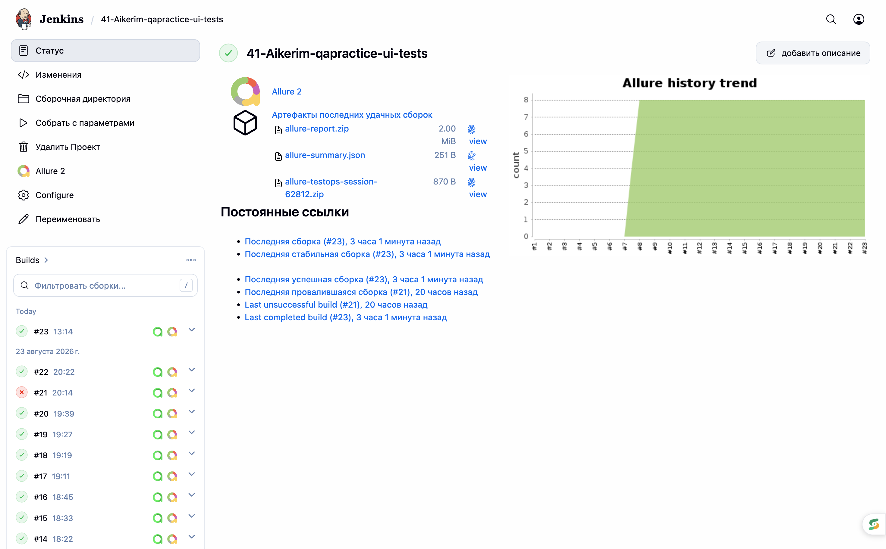
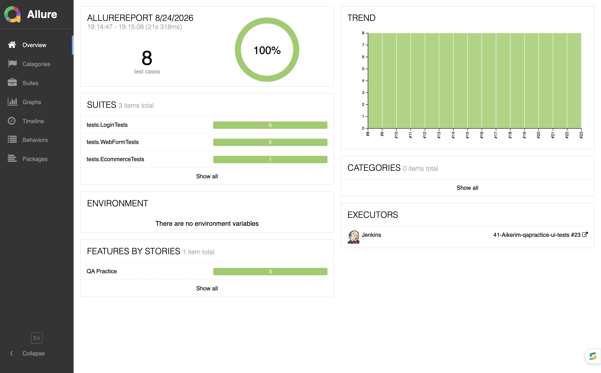
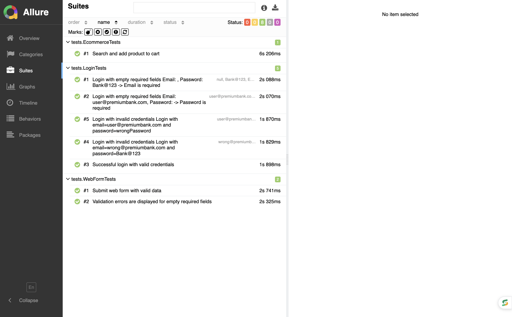
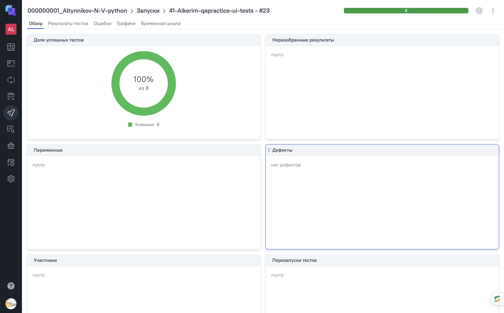
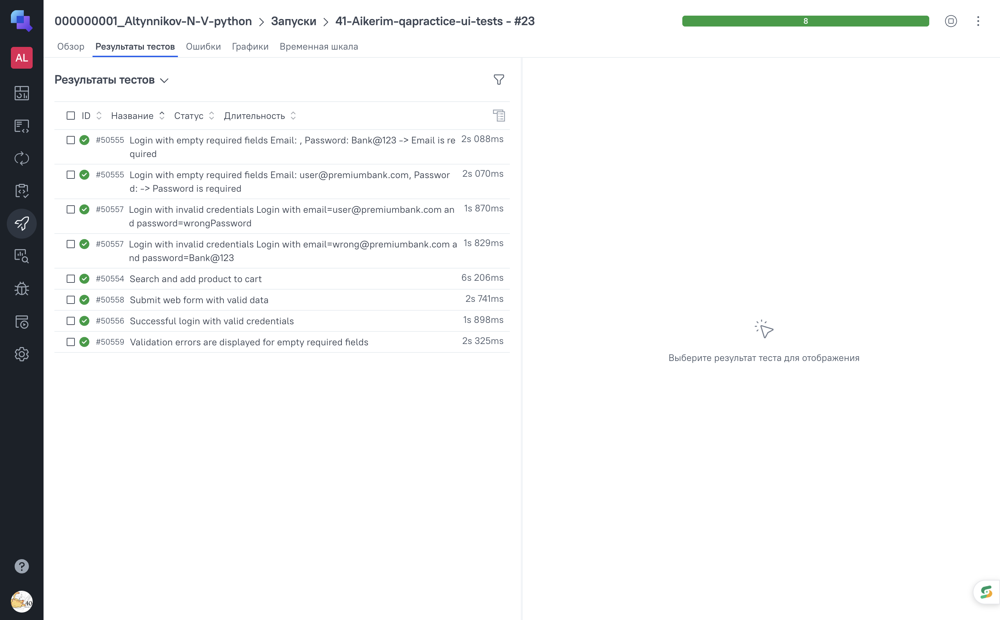
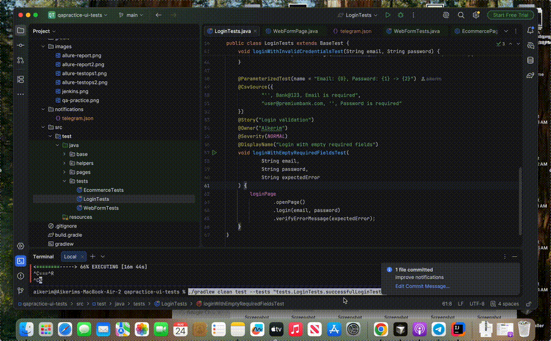

# QA Practice UI Tests

<p align="center">
  
</p>

## About the project

UI test automation project for the QA Practice web application.

The project covers main user scenarios and demonstrates UI test automation using Java, Selenide, JUnit 5, Gradle, Allure Report, Allure TestOps, Jenkins and Selenoid.

## Technology Stack

<p align="center">
  
  
  
  
  
  
</p>

## Test Scenarios

- Successful login with valid credentials
- Login with invalid credentials
- Login validation with empty required fields
- Web form submission
- UI element validation

## Running Tests

Run tests locally:

```bash
./gradlew clean test
```

Generate Allure Report:

```bash
./gradlew allureReport
```

Open Allure Report:

```bash
./gradlew allureServe
```

## Jenkins

The project is integrated with Jenkins CI for remote test execution.

### [Open Jenkins Job](https://jenkins.qa.guru/job/41-Aikerim-qapractice-ui-tests/)

<p align="center">
  <a href="https://jenkins.qa.guru/job/41-Aikerim-qapractice-ui-tests/">
    
  </a>
</p>

## Allure Report

Allure Report is used to display test execution results, test steps and attachments.

### [Open Allure Report](https://jenkins.qa.guru/job/41-Aikerim-qapractice-ui-tests/allure/)

<p align="center">
  <a href="https://jenkins.qa.guru/job/41-Aikerim-qapractice-ui-tests/allure/">
    
  </a>
</p>

<p align="center">
  <a href="https://jenkins.qa.guru/job/41-Aikerim-qapractice-ui-tests/allure/">
    
  </a>
</p>

## Allure TestOps

The project is integrated with Allure TestOps for test management and test execution analysis.

### [Open Allure TestOps](https://allure.qa.guru/launch/55931)

<p align="center">
  <a href="https://allure.qa.guru/launch/55931">
    
  </a>
</p>

<p align="center">
  <a href="https://allure.qa.guru/launch/55931">
    
  </a>
</p>

## Test Execution

<p align="center">
  
</p>